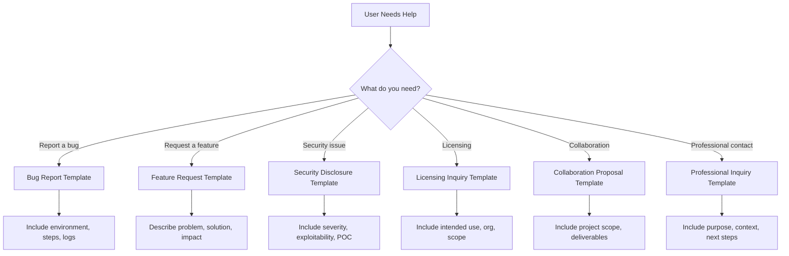

# Project Vantage — Inquiry Templates

All inquiries go to **lucaspaganopolisel@gmail.com**.  
Click a link to open a prefilled email draft. Each language section is collapsed by default for readability.

---

## Inquiry Flowchart

---

🇺🇸 English

### Licensing Inquiry
[Send Licensing Inquiry](mailto:lucaspaganopolisel@gmail.com?subject=Project%20Vantage%20Inquiry%20-%20Licensing&body=Hello%20Lucas,%0A%0AI%20am%20reaching%20out%20regarding%20Project%20Vantage.%0A%0AIntended%20use%20of%20the%20project:%0A______________________________________________%0A%0AOrganization%20name:%0A______________________________________________%0A%0ACommercial%20or%20non-commercial%20use:%0A______________________________________________%0A%0ASpecific%20scope%20or%20permissions%20requested:%0A______________________________________________%0A%0ATimeline%20or%20urgency:%0A______________________________________________%0A%0AAttachments%20included%20(if%20any):%20agreements%20/%20docs%20/%20supporting%20materials%0A%0AIf%20attachments%20are%20missing,%20please%20remember%20to%20include%20them%20before%20sending.%0A%0ABest%20regards,%0A[Your%20Name]%0A[Your%20Organization]%0A[Your%20Contact%20Information])

### Collaboration Proposal
[Send Collaboration Proposal](mailto:lucaspaganopolisel@gmail.com?subject=Project%20Vantage%20Inquiry%20-%20Collaboration&body=Hello%20Lucas,%0A%0AI%20am%20reaching%20out%20regarding%20Project%20Vantage.%0A%0AProject%20overview%20and%20goals:%0A______________________________________________%0A%0AExpected%20deliverables%20or%20outcomes:%0A______________________________________________%0A%0ATimeline%20and%20availability:%0A______________________________________________%0A%0ALinks%20to%20relevant%20documents%20or%20repositories:%0A______________________________________________%0A%0ANDA%20requirements%20(if%20any):%0A______________________________________________%0A%0AAttachments%20included%20(if%20any):%20proposal%20docs%20/%20diagrams%20/%20supporting%20materials%0A%0ABest%20regards,%0A[Your%20Name]%0A[Your%20Organization]%0A[Your%20Contact%20Information])

### Security Disclosure
[Send Security Disclosure](mailto:lucaspaganopolisel@gmail.com?subject=Project%20Vantage%20Inquiry%20-%20Security%20Disclosure&body=Hello%20Lucas,%0A%0AI%20am%20reporting%20a%20security%20issue%20related%20to%20Project%20Vantage.%0A%0ASeverity%20(Low%20/%20Medium%20/%20High%20/%20Critical):%0A______________________________________________%0A%0AIs%20the%20issue%20exploitable%20(Yes%20/%20No):%0A______________________________________________%0A%0ASteps%20to%20reproduce%20(or%20POC):%0A______________________________________________%0A______________________________________________%0A%0AAffected%20components%20or%20services:%0A______________________________________________%0A%0AIs%20this%20time-sensitive%20(Yes%20/%20No):%0A______________________________________________%0A%0AAttachments%20included%20(if%20any):%20poc%20/%20logs%20/%20screenshots%0A%0AIf%20attachments%20are%20missing,%20please%20remember%20to%20include%20them%20before%20sending.%0A%0ABest%20regards,%0A[Your%20Name]%0A[Your%20Organization]%0A[Your%20Contact%20Information])

### Professional Inquiry
[Send Professional Inquiry](mailto:lucaspaganopolisel@gmail.com?subject=Project%20Vantage%20Inquiry%20-%20Professional%20Inquiry&body=Hello%20Lucas,%0A%0AI%20am%20reaching%20out%20regarding%20Project%20Vantage.%0A%0APurpose%20of%20contact:%0A______________________________________________%0A%0AContext%20or%20background:%0A______________________________________________%0A%0AExpected%20outcome%20or%20next%20steps:%0A______________________________________________%0A%0AAvailability%20for%20a%20call%20or%20meeting:%0A______________________________________________%0A%0AAttachments%20included%20(if%20any):%20docs%20/%20references%0A%0ABest%20regards,%0A[Your%20Name]%0A[Your%20Organization]%0A[Your%20Contact%20Information])

### Bug Report
[Send Bug Report](mailto:lucaspaganopolisel@gmail.com?subject=Project%20Vantage%20Inquiry%20-%20Bug%20Report&body=Hello%20Lucas,%0A%0AI%20am%20reporting%20a%20bug%20in%20Project%20Vantage.%0A%0AEnvironment%20(OS%20/%20Browser%20/%20Version%20/%20Device):%0A______________________________________________%0A%0ASteps%20to%20reproduce:%0A1.%20______________________________________________%0A2.%20______________________________________________%0A3.%20______________________________________________%0A%0AExpected%20behavior:%0A______________________________________________%0A%0AActual%20behavior:%0A______________________________________________%0A%0ALogs%20or%20screenshots%20included%20(if%20any):%0A______________________________________________%0A%0AAdditional%20notes:%0A______________________________________________%0A%0ABest%20regards,%0A[Your%20Name]%0A[Your%20Organization]%0A[Your%20Contact%20Information])

### Feature Request
[Send Feature Request](mailto:lucaspaganopolisel@gmail.com?subject=Project%20Vantage%20Inquiry%20-%20Feature%20Request&body=Hello%20Lucas,%0A%0AI%20would%20like%20to%20propose%20a%20feature%20for%20Project%20Vantage.%0A%0AProblem%20this%20feature%20solves:%0A______________________________________________%0A%0AProposed%20solution:%0A______________________________________________%0A%0AAlternatives%20considered:%0A______________________________________________%0A%0AImpact%20or%20expected%20benefits:%0A______________________________________________%0A%0AAttachments%20included%20(if%20any):%20mockups%20/%20diagrams%20/%20docs%0A%0ABest%20regards,%0A[Your%20Name]%0A[Your%20Organization]%0A[Your%20Contact%20Information])

🇧🇷 Português (BR)

### Licenciamento
[Enviar Solicitação de Licenciamento](mailto:lucaspaganopolisel@gmail.com?subject=Project%20Vantage%20Inquiry%20-%20Licenciamento&body=Olá%20Lucas,%0A%0AEstou%20entrando%20em%20contato%20sobre%20o%20Project%20Vantage.%0A%0AUso%20pretendido%20do%20projeto:%0A______________________________________________%0A%0ANome%20da%20organização:%0A______________________________________________%0A%0AUso%20comercial%20ou%20não%20comercial:%0A______________________________________________%0A%0AEscopo%20ou%20permissões%20solicitadas:%0A______________________________________________%0A%0APrazo%20ou%20urgência:%0A______________________________________________%0A%0AAnexos%20incluídos%20(se%20houver):%20acordos%20/%20documentos%20/%20materiais%0A%0ASe%20faltarem%20anexos,%20lembre-se%20de%20incluí-los%20antes%20de%20enviar.%0A%0AAtenciosamente,%0A[Seu%20Nome]%0A[Sua%20Organização]%0A[Suas%20Informações%20de%20Contato])

### Proposta de Colaboração
[Enviar Proposta de Colaboração](mailto:lucaspaganopolisel@gmail.com?subject=Project%20Vantage%20Inquiry%20-%20Colabora%C3%A7%C3%A3o&body=Olá%20Lucas,%0A%0AEstou%20entrando%20em%20contato%20sobre%20o%20Project%20Vantage.%0A%0AVisão%20geral%20do%20projeto%20e%20objetivos:%0A______________________________________________%0A%0AEntregáveis%20esperados:%0A______________________________________________%0A%0APrazo%20e%20disponibilidade:%0A______________________________________________%0A%0ALinks%20para%20documentos%20ou%20repositórios:%0A______________________________________________%0A%0ARequisitos%20de%20NDA%20(se%20houver):%0A______________________________________________%0A%0AAnexos%20incluídos%20(se%20houver):%20proposta%20/%20diagramas%20/%20materiais%0A%0AAtenciosamente,%0A[Seu%20Nome]%0A[Sua%20Organização]%0A[Suas%20Informações%20de%20Contato])

### Divulgação de Segurança
[Enviar Divulgação de Segurança](mailto:lucaspaganopolisel@gmail.com?subject=Project%20Vantage%20Inquiry%20-%20Divulga%C3%A7%C3%A3o%20de%20Seguran%C3%A7a&body=Olá%20Lucas,%0A%0AEstou%20reportando%20um%20problema%20de%20segurança%20relacionado%20ao%20Project%20Vantage.%0A%0ANível%20(Low%20/%20Medium%20/%20High%20/%20Critical):%0A______________________________________________%0A%0E%20explorável%20(Yes%20/%20No):%0A______________________________________________%0A%0APassos%20para%20reproduzir%20(ou%20POC):%0A______________________________________________%0A______________________________________________%0A%0AComponentes%20afetados:%0A______________________________________________%0A%0AÉ%20sensível%20a%20tempo%20(Yes%20/%20No):%0A______________________________________________%0A%0AAnexos%20incluídos%20(se%20houver):%20poc%20/%20logs%20/%20prints%0A%0AAtenciosamente,%0A[Seu%20Nome]%0A[Sua%20Organização]%0A[Suas%20Informações%20de%20Contato])

### Contato Profissional
[Enviar Contato Profissional](mailto:lucaspaganopolisel@gmail.com?subject=Project%20Vantage%20Inquiry%20-%20Contato%20Profissional&body=Olá%20Lucas,%0A%0AEstou%20entrando%20em%20contato%20sobre%20o%20Project%20Vantage.%0A%0AObjetivo%20do%20contato:%0A______________________________________________%0A%0AContexto%20ou%20histórico:%0A______________________________________________%0A%0AResultado%20esperado%20ou%20próximos%20passos:%0A______________________________________________%0A%0ADisponibilidade%20para%20reunião:%0A______________________________________________%0A%0AAnexos%20incluídos%20(se%20houver):%20documentos%20/%20referências%0A%0AAtenciosamente,%0A[Seu%20Nome]%0A[Sua%20Organização]%0A[Suas%20Informações%20de%20Contato])

### Relato de Bug
[Enviar Relato de Bug](mailto:lucaspaganopolisel@gmail.com?subject=Project%20Vantage%20Inquiry%20-%20Relato%20de%20Bug&body=Olá%20Lucas,%0A%0AEstou%20reportando%20um%20bug%20no%20Project%20Vantage.%0A%0AAmbiente%20(OS%20/%20Browser%20/%20Versão%20/%20Dispositivo):%0A______________________________________________%0A%0APassos%20para%20reproduzir:%0A1.%20______________________________________________%0A2.%20______________________________________________%0A3.%20______________________________________________%0A%0AComportamento%20esperado:%0A______________________________________________%0A%0AComportamento%20real:%0A______________________________________________%0A%0ALogs%20ou%20prints%20incluídos%20(se%20houver):%0A______________________________________________%0A%0AObservações%20adicionais:%0A______________________________________________%0A%0AAtenciosamente,%0A[Seu%20Nome]%0A[Sua%20Organização]%0A[Suas%20Informações%20de%20Contato])

### Solicitação de Funcionalidade
[Enviar Solicitação de Funcionalidade](mailto:lucaspaganopolisel@gmail.com?subject=Project%20Vantage%20Inquiry%20-%20Solicita%C3%A7%C3%A3o%20de%20Funcionalidade&body=Olá%20Lucas,%0A%0AGostaria%20de%20sugerir%20uma%20funcionalidade%20para%20o%20Project%20Vantage.%0A%0AProblema%20que%20essa%20funcionalidade%20resolve:%0A______________________________________________%0A%0ASolu%C3%A7%C3%A3o%20proposta:%0A______________________________________________%0A%0AAlternativas%20consideradas:%0A______________________________________________%0A%0AImpacto%20ou%20benef%C3%ADcios%20esperados:%0A______________________________________________%0A%0AAnexos%20inclu%C3%ADdos%20(se%20houver):%20mockups%20/%20diagramas%20/%20docs%0A%0AAtenciosamente,%0A[Seu%20Nome]%0A[Sua%20Organização]%0A[Suas%20Informações%20de%20Contato])

🇪🇸 Español

### Solicitud de Licencia
[Enviar Solicitud de Licencia](mailto:lucaspaganopolisel@gmail.com?subject=Project%20Vantage%20Inquiry%20-%20Licencia&body=Hola%20Lucas,%0A%0AMe%20pongo%20en%20contacto%20por%20Project%20Vantage.%0A%0AUso%20previsto%20del%20proyecto:%0A______________________________________________%0A%0ANombre%20de%20la%20organización:%0A______________________________________________%0A%0AUso%20comercial%20o%20no%20comercial:%0A______________________________________________%0A%0Alcance%20o%20permisos%20solicitados:%0A______________________________________________%0A%0APlazo%20o%20urgencia:%0A______________________________________________%0A%0AAdjuntos%20incluidos%20(si%20los%20hay):%20acuerdos%20/%20documentos%20/%20materiales%0A%0ASi%20faltan%20adjuntos,%20recuerde%20incluirlos%20antes%20de%20enviar.%0A%0ASaludos,%0A[Su%20Nombre]%0A[Su%20Organización]%0A[Su%20Información%20de%20Contacto])

### Propuesta de Colaboración
[Enviar Propuesta de Colaboración](mailto:lucaspaganopolisel@gmail.com?subject=Project%20Vantage%20Inquiry%20-%20Colaboraci%C3%B3n&body=Hola%20Lucas,%0A%0AMe%20pongo%20en%20contacto%20por%20Project%20Vantage.%0A%0AResumen%20del%20proyecto%20y%20objetivos:%0A______________________________________________%0A%0AEntregables%20esperados:%0A______________________________________________%0A%0ACronograma%20y%20disponibilidad:%0A______________________________________________%0A%0AEnlaces%20a%20documentos%20o%20repositorios:%0A______________________________________________%0A%0ARequisitos%20de%20NDA%20(si%20los%20hay):%0A______________________________________________%0A%0AAdjuntos%20incluidos%20(si%20los%20hay):%20propuesta%20/%20diagramas%20/%20materiales%0A%0ASaludos,%0A[Su%20Nombre]%0A[Su%20Organización]%0A[Su%20Información%20de%20Contacto])

### Divulgación de Seguridad
[Enviar Divulgación de Seguridad](mailto:lucaspaganopolisel@gmail.com?subject=Project%20Vantage%20Inquiry%20-%20Divulgaci%C3%B3n%20de%20Seguridad&body=Hola%20Lucas,%0A%0AQuiero%20reportar%20un%20problema%20de%20seguridad%20relacionado%20con%20Project%20Vantage.%0A%0ANivel%20(Low%20/%20Medium%20/%20High%20/%20Critical):%0A______________________________________________%0A%0AEs%20explotable%20(Yes%20/%20No):%0A______________________________________________%0A%0APasos%20para%20reproducir%20(o%20POC):%0A______________________________________________%0A______________________________________________%0A%0AComponentes%20afectados:%0A______________________________________________%0A%0AEs%20urgente%20(Yes%20/%20No):%0A______________________________________________%0A%0AAdjuntos%20incluidos%20(si%20los%20hay):%20poc%20/%20logs%20/%20capturas%0A%0ASaludos,%0A[Su%20Nombre]%0A[Su%20Organización]%0A[Su%20Información%20de%20Contacto])

### Consulta Profesional
[Enviar Consulta Profesional](mailto:lucaspaganopolisel@gmail.com?subject=Project%20Vantage%20Inquiry%20-%20Consulta%20Profesional&body=Hola%20Lucas,%0A%0AMe%20pongo%20en%20contacto%20por%20Project%20Vantage.%0A%0APropósito%20del%20contacto:%0A______________________________________________%0A%0AContexto%20o%20antecedentes:%0A______________________________________________%0A%0AResultado%20esperado%20o%20siguientes%20pasos:%0A______________________________________________%0A%0ADisponibilidad%20para%20reunión:%0A______________________________________________%0A%0AAdjuntos%20incluidos%20(si%20los%20hay):%20documentos%20/%20referencias%0A%0ASaludos,%0A[Su%20Nombre]%0A[Su%20Organización]%0A[Su%20Información%20de%20Contacto])

### Reporte de Bug
[Enviar Reporte de Bug](mailto:lucaspaganopolisel@gmail.com?subject=Project%20Vantage%20Inquiry%20-%20Reporte%20de%20Bug&body=Hola%20Lucas,%0A%0AQuiero%20reportar%20un%20bug%20en%20Project%20Vantage.%0A%0AEntorno%20(OS%20/%20Navegador%20/%20Versión%20/%20Dispositivo):%0A______________________________________________%0A%0APasos%20para%20reproducir:%0A1.%20______________________________________________%0A2.%20______________________________________________%0A3.%20______________________________________________%0A%0AComportamiento%20esperado:%0A______________________________________________%0A%0AComportamiento%20real:%0A______________________________________________%0A%0ALogs%20o%20capturas%20incluidas%20(si%20las%20hay):%0A______________________________________________%0A%0ANotas%20adicionales:%0A______________________________________________%0A%0ASaludos,%0A[Su%20Nombre]%0A[Su%20Organización]%0A[Su%20Información%20de%20Contacto])

### Solicitud de Funcionalidad
[Enviar Solicitud de Funcionalidad](mailto:lucaspaganopolisel@gmail.com?subject=Project%20Vantage%20Inquiry%20-%20Solicitud%20de%20Funcionalidad&body=Hola%20Lucas,%0A%0AMe%20gustaría%20proponer%20una%20funcionalidad%20para%20Project%20Vantage.%0A%0AProblema%20que%20resuelve:%0A______________________________________________%0A%0ASolución%20propuesta:%0A______________________________________________%0A%0AAlternativas%20consideradas:%0A______________________________________________%0A%0AImpacto%20o%20beneficios%20esperados:%0A______________________________________________%0A%0AAdjuntos%20incluidos%20(si%20los%20hay):%20mockups%20/%20diagramas%20/%20docs%0A%0ASaludos,%0A[Su%20Nombre]%0A[Su%20Organización]%0A[Su%20Información%20de%20Contacto])

🇫🇷 Français

### Demande de Licence
[Envoyer une Demande de Licence](mailto:lucaspaganopolisel@gmail.com?subject=Project%20Vantage%20Inquiry%20-%20Demande%20de%20Licence&body=Bonjour%20Lucas,%0A%0AJe%20vous%20contacte%20au%20sujet%20de%20Project%20Vantage.%0A%0AUsage%20pr%C3%A9vu%20du%20projet:%0A______________________________________________%0A%0ANom%20de%20l'organisation:%0A______________________________________________%0A%0AUsage%20commercial%20ou%20non%20commercial:%0A______________________________________________%0A%0APort%C3%A9e%20ou%20autorisations%20demand%C3%A9es:%0A______________________________________________%0A%0Ech%C3%A9ance%20ou%20urgence:%0A______________________________________________%0A%0APi%C3%A8ces%20jointes%20(incluses%20le%20cas%20%C3%A9ch%C3%A9ant):%20accords%20/%20documents%20/%20mat%C3%A9riels%0A%0ASi%20des%20pi%C3%A8ces%20jointes%20manquent,%20merci%20de%20les%20ajouter%20avant%20l'envoi.%0A%0ACordialement,%0A[Votre%20Nom]%0A[Votre%20Organisation]%0A[Vos%20Coordonn%C3%A9es])

### Proposition de Collaboration
[Envoyer une Proposition de Collaboration](mailto:lucaspaganopolisel@gmail.com?subject=Project%20Vantage%20Inquiry%20-%20Collaboration&body=Bonjour%20Lucas,%0A%0AJe%20vous%20contacte%20au%20sujet%20de%20Project%20Vantage.%0A%0APr%C3%A9sentation%20du%20projet%20et%20objectifs:%0A______________________________________________%0A%0ALivrables%20attendus:%0A______________________________________________%0A%0Ech%C3%A9ancier%20et%20disponibilit%C3%A9:%0A______________________________________________%0A%0ALiens%20vers%20documents%20ou%20r%C3%A9pertoires:%0A______________________________________________%0A%0AExigences%20de%20NDA%20(le%20cas%20%C3%A9ch%C3%A9ant):%0A______________________________________________%0A%0APi%C3%A8ces%20jointes%20(incluses%20le%20cas%20%C3%A9ch%C3%A9ant):%20proposition%20/%20diagrammes%20/%20mat%C3%A9riels%0A%0ACordialement,%0A[Votre%20Nom]%0A[Votre%20Organisation]%0A[Vos%20Coordonn%C3%A9es])

### Signalement de Sécurité
[Envoyer un Signalement de Sécurité](mailto:lucaspaganopolisel@gmail.com?subject=Project%20Vantage%20Inquiry%20-%20Signalement%20de%20S%C3%A9curit%C3%A9&body=Bonjour%20Lucas,%0A%0AJe%20signale%20un%20probl%C3%A8me%20de%20s%C3%A9curit%C3%A9%20concernant%20Project%20Vantage.%0A%0ANiveau%20(Low%20/%20Medium%20/%20High%20/%20Critical):%0A______________________________________________%0A%0ALa%20faille%20est-elle%20exploitable%20(Yes%20/%20No):%0A______________________________________________%0A%0E%20tapes%20pour%20reproduire%20(ou%20POC):%0A______________________________________________%0A______________________________________________%0A%0AComposants%20affect%C3%A9s:%0A______________________________________________%0A%0AEst-ce%20urgent%20(Yes%20/%20No):%0A______________________________________________%0A%0APi%C3%A8ces%20jointes%20(incluses%20le%20cas%20%C3%A9ch%C3%A9ant):%20poc%20/%20logs%20/%20captures%0A%0ACordialement,%0A[Votre%20Nom]%0A[Votre%20Organisation]%0A[Vos%20Coordonn%C3%A9es])

### Demande Professionnelle
[Envoyer une Demande Professionnelle](mailto:lucaspaganopolisel@gmail.com?subject=Project%20Vantage%20Inquiry%20-%20Demande%20Professionnelle&body=Bonjour%20Lucas,%0A%0AJe%20vous%20contacte%20au%20sujet%20de%20Project%20Vantage.%0A%0AObjet%20du%20contact:%0A______________________________________________%0A%0AContexte%20ou%20historique:%0A______________________________________________%0A%0AR%C3%A9sultat%20attendu%20ou%20%C3%A9tapes%20suivantes:%0A______________________________________________%0A%0ADisponibilit%C3%A9%20pour%20un%20appel%20ou%20une%20r%C3%A9union:%0A______________________________________________%0A%0APi%C3%A8ces%20jointes%20(incluses%20le%20cas%20%C3%A9ch%C3%A9ant):%20documents%20/%20r%C3%A9f%C3%A9rences%0A%0ACordialement,%0A[Votre%20Nom]%0A[Votre%20Organisation]%0A[Vos%20Coordonn%C3%A9es])

### Rapport de Bug
[Envoyer un Rapport de Bug](mailto:lucaspaganopolisel@gmail.com?subject=Project%20Vantage%20Inquiry%20-%20Rapport%20de%20Bug&body=Bonjour%20Lucas,%0A%0AJe%20signale%20un%20bug%20dans%20Project%20Vantage.%0A%0AEnvironnement%20(OS%20/%20Navigateur%20/%20Version%20/%20Appareil):%0A______________________________________________%0A%0AEtapes%20pour%20reproduire:%0A1.%20______________________________________________%0A2.%20______________________________________________%0A3.%20______________________________________________%0A%0AComportement%20attendu:%0A______________________________________________%0A%0AComportement%20actuel:%0A______________________________________________%0A%0ALogs%20ou%20captures%20inclus%20(si%20applicable):%0A______________________________________________%0A%0ANotes%20suppl%C3%A9mentaires:%0A______________________________________________%0A%0ACordialement,%0A[Votre%20Nom]%0A[Votre%20Organisation]%0A[Vos%20Coordonn%C3%A9es])

### Demande de Fonctionnalité
[Envoyer une Demande de Fonctionnalité](mailto:lucaspaganopolisel@gmail.com?subject=Project%20Vantage%20Inquiry%20-%20Demande%20de%20Fonctionnalit%C3%A9&body=Bonjour%20Lucas,%0A%0AJ'aimerais%20proposer%20une%20fonctionnalit%C3%A9%20pour%20Project%20Vantage.%0A%0AProbl%C3%A8me%20que%20cela%20r%C3%A9solt:%0A______________________________________________%0A%0ASolution%20propos%C3%A9e:%0A______________________________________________%0A%0AAlternatives%20envisag%C3%A9es:%0A______________________________________________%0A%0AImpact%20ou%20b%C3%A9n%C3%A9fices%20attendus:%0A______________________________________________%0A%0APi%C3%A8ces%20jointes%20(incluses%20le%20cas%20%C3%A9ch%C3%A9ant):%20maquettes%20/%20diagrammes%20/%20docs%0A%0ACordialement,%0A[Votre%20Nom]%0A[Votre%20Organisation]%0A[Vos%20Coordonn%C3%A9es])

